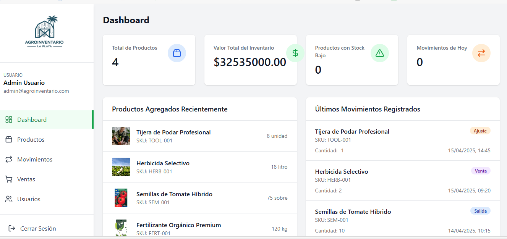

# AgroInventario

Sistema de gestión de inventario para productos agrícolas desarrollado con React, TypeScript y Vite.

## Descripción

AgroInventario es una aplicación web para la gestión completa de inventarios de productos agrícolas, que incluye las siguientes funcionalidades:

- Gestión de productos (agregar, editar, eliminar)
- Control de movimientos de inventario (entradas, salidas, ajustes)
- Registro de ventas
- Administración de usuarios
- Panel de control con estadísticas

## Requisitos previos

- Node.js (v14.0.0 o superior)
- npm (v6.0.0 o superior)

## Instalación

1. Clona este repositorio o descarga los archivos en tu equipo
2. Navega hasta la carpeta del proyecto
3. Instala las dependencias con el siguiente comando:

```bash
npm install
```

## Ejecución

Para iniciar el servidor de desarrollo, ejecuta:

```bash
npm run dev
```

La aplicación estará disponible en http://localhost:5173 (o el puerto que Vite asigne si el 5173 está ocupado).

## Compilación para producción

Para compilar la aplicación para producción:

```bash
npm run build
```

Los archivos compilados se guardarán en la carpeta `dist`.

## Previsualización de la versión compilada

Para previsualizar la versión de producción localmente:

```bash
npm run preview
```

## Acceso a la aplicación

Una vez que la aplicación esté en ejecución, puedes acceder con las siguientes credenciales:

- **Email**: admin@agroinventario.com
- **Contraseña**: password

## Tecnologías utilizadas

- React
- TypeScript
- Vite
- TailwindCSS
- React Router
- Lucide React (para iconos)

## Estructura de carpetas

- `/src/components`: Componentes de la aplicación organizados por funcionalidad
- `/src/pages`: Páginas principales de la aplicación
- `/src/data`: Datos de ejemplo para demostración
- `/src/types`: Definiciones de tipos TypeScript
- `/src/fuente`: Lógica y contextos (como autenticación)

## Capturas de pantalla



