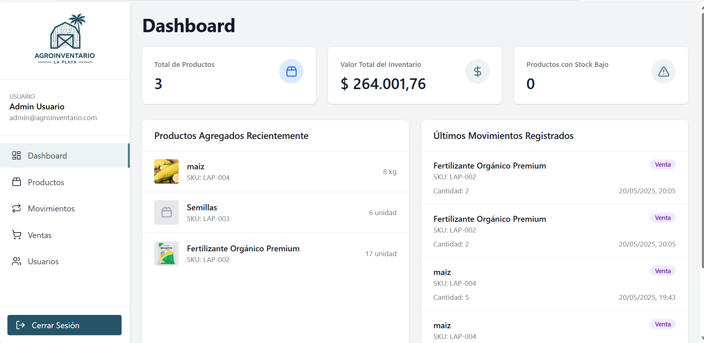

# AgroInventario

Sistema de gestión de inventario para productos agrícolas desarrollado con React, TypeScript y Vite.

## Descripción

AgroInventario es una aplicación web para la gestión completa de inventarios de productos agrícolas, diseñada para facilitar el seguimiento y control de productos del sector agrícola. Incluye las siguientes funcionalidades:

- Gestión de productos (agregar, editar, eliminar)
- Control de movimientos de inventario (entradas, salidas, ajustes)
- Registro y seguimiento de ventas
- Administración de usuarios y permisos
- Panel de control con estadísticas y gráficos

## Requisitos previos

- Node.js (v14.0.0 o superior)
- npm (v6.0.0 o superior)
- PostgreSQL (para la base de datos)

## Instalación

1. Clona este repositorio o descarga los archivos en tu equipo
2. Navega hasta la carpeta del proyecto
3. Instala las dependencias con el siguiente comando:

```bash
npm install
```

## Configuración

1. Crea un archivo `.env` en la raíz del proyecto con las siguientes variables:

```
DB_USER=tu_usuario_de_postgres
DB_PASSWORD=tu_contraseña
DB_HOST=localhost
DB_PORT=5432
DB_DATABASE=agroinventario
JWT_SECRET=tu_clave_secreta_para_jwt
VITE_OPENAI_API_KEY=tu_clave_api_de_openai
```

2. Configura la base de datos ejecutando:

```bash
node src/db/setup.ts
```

## Ejecución

Para iniciar solo el frontend de desarrollo:

```bash
npm run dev
```

La aplicación estará disponible en http://localhost:5173 (o el puerto que Vite asigne si el 5173 está ocupado).

## API y servidor backend

El backend de la aplicación proporciona una API REST para:
- Autenticación y manejo de sesiones
- CRUD completo para productos
- Gestión de inventario y movimientos
- Procesamiento de ventas
- Administración de usuarios
- Recomendaciones inteligentes con IA

Para iniciar solo el servidor backend:

```bash
npm run server
```

## Funcionalidad de Recomendaciones con IA

AgroInventario incorpora un sistema de recomendaciones inteligentes basado en OpenAI que analiza los datos de inventario y proporciona:

- Análisis diario del inventario con IA
- Resumen del estado actual del inventario
- Recomendaciones accionables para optimizar la gestión
- Observaciones detalladas sobre tendencias y oportunidades

Para habilitar esta funcionalidad, es necesario:

1. Instalar la librería de OpenAI:

```bash
npm install openai
```

2. Configurar una clave de API de OpenAI en el archivo `.env`:

```
VITE_OPENAI_API_KEY=tu_clave_api_de_openai
```

Para más detalles sobre esta funcionalidad, consulta el archivo [RECOMENDACIONES-IA.md](./RECOMENDACIONES-IA.md) incluido en el proyecto.

## Verificación de código

Para ejecutar el linter y verificar la calidad del código:

```bash
npm run lint
```

## Acceso a la aplicación

Una vez que la aplicación esté en ejecución, puedes acceder con las siguientes credenciales:

- **Email**: admin@agroinventario.com
- **Contraseña**: admin123

## Tecnologías utilizadas

### Frontend
- React 18
- TypeScript
- Vite
- TailwindCSS
- React Router
- Lucide React (para iconos)
- OpenAI API (para recomendaciones inteligentes)

### Backend
- Express
- PostgreSQL
- JSON Web Token (JWT)
- bcrypt (para encriptación)

## Estructura del proyecto

- `/src/components`: Componentes React organizados por funcionalidad
- `/src/paginas`: Páginas principales de la aplicación
- `/src/services`: Servicios para comunicación con la API
- `/src/controllers`: Controladores para manejar las rutas de la API
- `/src/repositories`: Capa de acceso a datos
- `/src/db`: Configuración y conexión a la base de datos
- `/src/types`: Definiciones de tipos TypeScript
- `/src/fuente`: Lógica de autenticación y contextos
- `/src/middleware`: Middleware de autenticación y autorización
- `/src/utilities`: Funciones auxiliares y utilidades

## Capturas de pantalla




